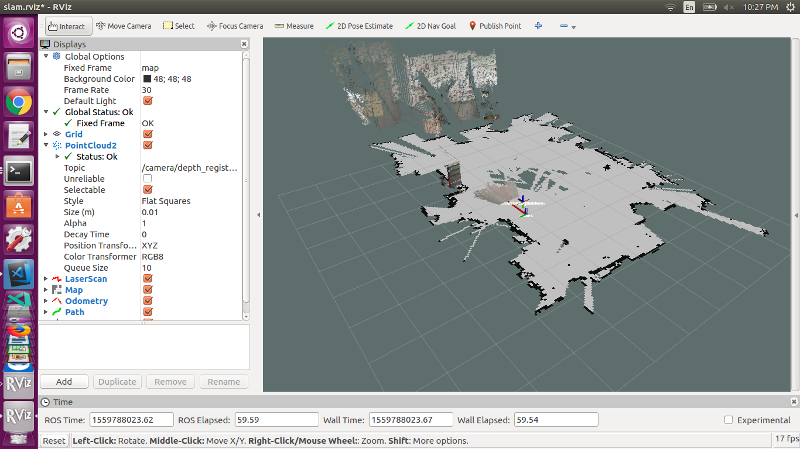

# gait_training_robot
This ROS package provides a suite of software that performs gait-training tasks such as engaging people in walkinging exercise, analyzing people's gait, and providing corrective feedback. Some launch files in this package are a good starting point to get [P3-DX robot](https://www.generationrobots.com/media/Pioneer3DX-P3DX-RevA.pdf) with a Kinect sensor to perform some generic SLAM/localization/planning tasks. The development of this package is ongoing.

## Prerequisites
- [P3-DX robot](https://www.generationrobots.com/media/Pioneer3DX-P3DX-RevA.pdf)
- Ubuntu 18.04
- [ROS Melodic](http://wiki.ros.org/melodic/Installation/Ubuntu)
- [Aria](https://github.com/zchenpds/Aria.git) MobileRobots' Advanced Robot Interface for Applications (ARIA) is a C++ library/SDK for all MobileRobots/ActivMedia platforms.
- [rosaria](https://github.com/amor-ros-pkg/rosaria) (A ROS wrapper for ARIA)

## Checklist for Kinect v1
1. Install pointcloud_to_laserscan. This package converts pointcloud data to laserscan data so that gmapping can use it to build a map. Required only if gmapi
  ```bash
  sudo apt-get install ros-melodic-pointcloud-to-laserscan
  ```
2. Install openni_launch. This is the primary driver for Kinect v1 sensor.
  ```bash
  sudo apt-get install ros-melodic-openni-launch
  ```
3. Install gmapping. (optional, alternative to rtabmap)
  ```bash
  sudo apt-get install ros-melodic-gmapping
  ```
4. Install hector_trajectory_server (optional, this package is only available for ROS Kinetic)
  ```bash
  sudo apt-get install ros-kinetic-hector-trajectory-server
  ```
5. Install move_base. This package takes a map published by either rtabmap or gmapping and computes the viable path to a specified goal.
  ```bash
  sudo apt-get install ros-melodic-move-base
  ```
6. Install rtabmap_ros. This pacakge does 3D SLAM and builds the map to be used by the motion planner.
  ```bash
  sudo apt-get install ros-melodic-rtabmap-ros
  ```

## Checklist for the robot
1. Install libaria from source. Package rosaria is dependent on it.
   ```bash
   cd ~/projects
   git clone https://github.com/zchenpds/Aria.git
   cd Aria
   make
   sudo make install
   echo 'export LD_LIBRARY_PATH=$LD_LIBRARY_PATH:/usr/local/Aria/lib' >> ~/.bashrc
   sudo ldconfig
   ```
2. Download and `catkin_make` a forked source of rosaria
   ```bash
   cd ~/catkin_ws/src
   git clone https://github.com/zchenpds/rosaria.git
   ```
3. Are you a member of the dialout group? If not, run 
   ```bash
   sudo usermod -a -G dialout $USER 
   ```
4. Ensure you have read and write access to the COM port by running 
   ```bash
   sudo chmod a+rw /dev/ttyUSB0
   ```
5. Test it. 
   ```bash
   rosrun rosaria RosAria
   ```

## Checklist for the gait analyzer
1. Install [Azure Kinect ROS Driver](https://github.com/microsoft/Azure_Kinect_ROS_Driver) from source. [Azure Kinect DK](https://docs.microsoft.com/en-us/azure/Kinect-dk/) sensor faces backward and monitors the body movement of the human following the robot.

## Two-machine configuration
Two-machine configuration consists of a desktop computer, a robot computer and wifi router. Both machines are connected to the router to allow for faster communication. To remotely monitor and control the robot computer from the desktop computer, we need to set up ssh and some ROS parameters. The steps for setting up ssh are as follows:
1. Ensure both machines have the same Ubuntu version and ROS version.
1. If you do not have the SSH key generated yet, run `ssh-keygen` on the desktop PC. Press enter to use the default path to save the key to. Press enter again to use no passphrase.
1. Run `ssh-copy-id robotname@192.168.1.102` to copy the generated key to the remote machine, where "robotname" is username of the onboard laptop and "192.168.1.102" is the IP address of the robot computer. IP address of either machine can be found by running `hostname -I`.
1. The previous steps need to be done only once. In the future, to start an ssh session, run `ssh robotname@192.168.1.102`

Follow these steps to set up the relevant ROS parameters
1. Add `export ROS_IP=$(hostname -I)` to the  `~/.bashrc` file of each of the machines.
1. On the desktop computer, add `export ROS_MASTER_URI=http://MASTER_IP:11311/` to `~/.bashrc`.
1. Remember to restart the terminals in order for the changes to take effect.

# Examples

1. SLAM using gmapping
  - **One Machine**. run `roslaunch gait_training_robot test1_slam_headless.launch`.
  - **Two Machines**. 
    1. On the robot computer (master), run `roslaunch gait_training_robot test1_slam_headless.launch`.
    2. On the desktop computer, run `roslaunch gait_training_robot test1_slam_rviz.launch`.
    3. Note that if kinect2_bridge package is started via ssh, it is necessary to tell GLFW to be launched on a server screen by running `export DISPLAY=:0` after `ssh`ing to the server.
    

2. Planning using gmapping
  - **Two Machines**.
    1. On the robot computer (master), run `roslaunch gait_training_robot test2_plan_headless.launch`.
    2. On the desktop computer, run `roslaunch gait_training_robot test1_slam_rviz.launch`.

3. SLAM using rtabmap_ros
  - **Two Machines**.
    1. On the robot computer (master), run `roslaunch gait_training_robot test1_rtabmap_headless.launch localization:=false enable_distance_controller:=false`.
    2. On the desktop computer, start rviz by running `roslaunch gait_training_robot test1_rviz_rtabmap.launch`.
4. Localization using rtabmap
  - **Two Machines**. Requires a map built by rtabmap.
    1. On the robot computer (master), run `roslaunch gait_training_robot test1_rtabmap_headless.launch localization:=true enable_distance_controller:=false`.
    2. On the desktop computer, start rviz by running `roslaunch gait_training_robot test1_rviz_rtabmap.launch`.
    3. To record waypoints on the robot computer, start a new terminal and run `rostopic echo /move_base_simple/goal > ~/catkin_ws/src/gait_training_robot/data/waypoints.yaml` on the robot computer, and publish goals from rviz. 
    4. To play back waypoints that have been recorded on the robot computer, run `rosrun gait_training_robot goal_generator`.
    5. Sometimes, the robot maybe stuck somewhere because it mistakenly perceives an obstacle which does not exist. In this case, we want to clear the cost map by running `rosservice call /move_base/clear_costmaps "{}"`.
5. Human distance controller
  - **Three Machines**. Requires a map built by rtabmap. Requires waypoints to be recorded.
    1. On the robot computer (master), run `roslaunch gait_training_robot test1_rtabmap_headless.launch localization:=true enable_distance_controller:=true`.
    2. On the desktop computer, start rviz by running `roslaunch gait_training_robot test1_rviz_rtabmap.launch`.
    3. On the Windows computer, start `BodyTrackerAzure.exe`.
    4. To play back waypoints that have been recorded on the robot computer, run `rosrun gait_training_robot goal_generator`.
6. Validate urdf
  - **One Machine**. After changes are made to `urdf/*.urdf.xacro` files, use `catkin_make` to generate the urdf files.
    1. Run `roslaunch gait_training_robot rviz+urdf_state.launch`.
    
    

7. Test Kalman filter
  `roslaunch gait_training_robot test4_kalman_filter.launch record_bag:=true`
  `roslaunch gait_training_robot test4_kalman_filter.launch play_bag:=true bag_name:=data_2019-12-03-21-05-58.bag`