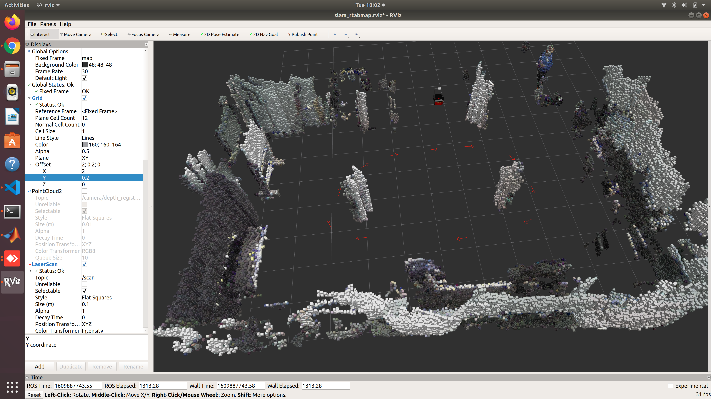
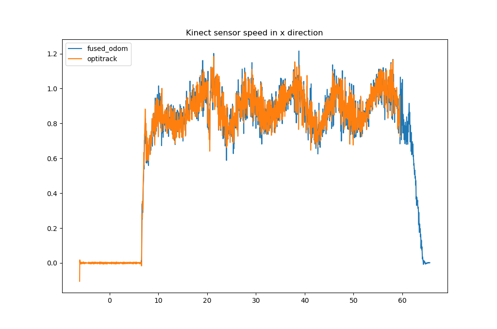
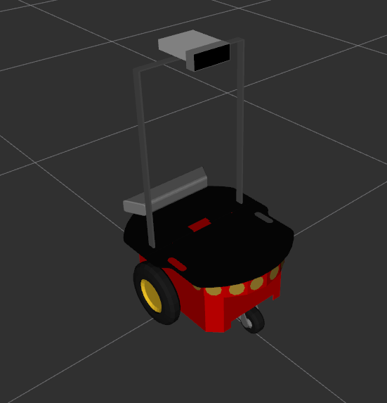

# gait_training_robot
This ROS package provides a suite of software that enables a mobile robot to perform gait-training tasks such as engaging people in walkinging exercise, analyzing people's gait, and providing corrective feedback. Some launch files in this package are a good starting point to get [P3-DX robot](https://www.generationrobots.com/media/Pioneer3DX-P3DX-RevA.pdf) with a Kinect sensor to perform some generic SLAM/localization/planning tasks. 


```bash
git clone --recurse-submodules https://github.com/zchenpds/gait_training_robot.git
```

# ROS Nodes


## [goal_generator](src/goal_generator.cpp)
This node loads a list of 2-D waypoints from a yaml file and sends them sequentially and cyclically to move_base if parameter `preview` is set to false. Each waypoint represents a goal pose for the robot to reach. A move_base action client is used to send the goal to the move_base action server and monitor the progress of the execution of the plan made by move_base. Once the distance of the robot to the current waypoint is below `dist_tolerance`, the next waypoint (or, in case the current waypoint is the last waypoint in the list, the first waypoint) will be sent over to the move_base action server. The node will terminate either when the attempt to reach the current waypoint times out or after the node has gone through the list of waypoints `max_num_laps` times. If `stop_upon_completion` is set to true, the node will attempt to kill all other nodes by sending SIGINT to them before terminating itself. The node can be configured to start pursuing the first goal with a delay of `delay_start_secs` seconds after startup. The path to the yaml file to be loaded is specified by parameters `yaml_file_path` + `suffix`. 

If parameter `preview` is set to true, this node loads the 2-D waypoints from the yaml file and publishes them all at once as a pose array under topic name `goal_poses` for the waypoints to be previewed in rviz.



## [distance_controller](src/distance_controller.cpp)
This node scales the input command velocity "/distance_controller/cmd_vel_in" provided by "move_base" and publishes the output on "/distance_controller/cmd_vel_out" to maintain the distance between the human and the robot. The actuating signal is calculated using a PI (proportional-integral) controller according to the difference between the desired distance `dist_desired` and the measured distance of the origin of the "base_link" from the pelvis joint as measured by the Azure Kinect Body Tracking SDK. If the input linear velocity is less `v_in_threshold`, the output command velocity would be an exact copy of the input to make sure the robot speed is safe in anticipation of an imminent collision with an obstacle. If the subject is not detected for longer than `timeout_threshold`, the output command velocity will be zeroed until the subject is detected again. The output linear velocity of the robot will not exceed `v_max`. Other parameters of the PI controller includes `u_i_max`, `K_p`, and `K_i`.

## [kinect_pose_estimator](src/kinect_pose_estimator.cpp)
This node fuses the Azure Kinect IMU data and the robot wheel odometry data to provide a more accurate sensor pose estimate than can be achieved by compositing the wheel odometry and the constant sensor mount transforms. This sensor fusion reduces the noise induced by the robot drivetrain gear backlash and the flexibility of the sensor mount structure. 

The output is available in two forms: tf from frame `kimu_frame` to `output_frame` (by default, "imu_link" -> "fused_odom"); a message of type "nav_msgs::Odometry" under topic name "~odom".

The header-only implementation of the filter can be found in [include/kpekf/ExtendedKalmanFilter.hpp](include/kpekf/ExtendedKalmanFilter.hpp). The parameters can be found in [params/kinect_pose_estimator.yaml](params/kinect_pose_estimator.yaml)


## [foot_pose_estimator](src/foot_pose_estimator.cpp)
This node fuses the inertial and RGB-D sensor measurements regarding the pose of each foot using a Kalman filter in order to provide a more accurate foot pose estimate than can be achieved by either sensor individually. If `enable_huber_update` is set to true, Huber cost function will be used to increase the estimator's robustness to outliers in RGB-D measurement. The RGB-D measurement is considered outlier if its residual is greater than `outlier_threashold`. 

The output foot poses are published under topic "~fused_pose_l" and "~fused_pose_r" of type "geometry_msgs::PoseWithCovarianceStamped". For visualization purposes, a marker array topic named "~fused_pose_marker_array" with shoe meshes is also supplied.

The header-only implementation of the filter can be found in [include/sport_sole_ekf/ExtendedKalmanFilter.hpp](include/sport_sole_ekf/ExtendedKalmanFilter.hpp). The parameters can be found in [params/foot_pose_estimator.yaml](params/foot_pose_estimator.yaml)

## [gait_analyzer](src/gait_analyzer.cpp)
This node estiamtes the subject's CoM (center of mass), CoM velocity, BoS (base of support) and MoS (Margin of stability) using RGB-D, plantar pressure and insole IMU sensors. 

The CoM and its velocity are estimated using a header-only implementation of a Kalman filter [include/comkf_optitrack/comkf.hpp](include/comkf_optitrack/comkf.hpp). The parameters can be found in [params/gait_analyzer2.yaml](params/gait_analyzer2.yaml)

# Data Processing Scripts

## [convert_optitrack_to_bag.py](utilities/convert_optitrack_to_bag.py)
This Python script can synchronize the data from from the two systems by finding the time offset that minimizes the cross correlation of the robot speed signals as supplied by the two systems. The resulting data  will be saved to ros bag.


```text
usage: convert_optitrack_to_bag.py [-h] [-o ADD_OFFSET] [-v] [-r] [-t] [-b]
                                   [-d] [-c] [-l LEN]
                                   trial_id

Converts an optitrack csv file to bag file.

positional arguments:
  trial_id

optional arguments:
  -h, --help            show this help message and exit
  -o ADD_OFFSET, --add_offset ADD_OFFSET
                        Add additional offset in case the cross correlation
                        does not work well
  -v, --show_vx_t
  -r, --show_corr
  -t, --show_th_t
  -b, --use_base_link_as_root
  -d, --delete_odom_bag
                        if flagged, the odom bag would be deleted and
                        generated again.
  -c, --calc_ga         if flagged, calc_ga.py will run after the bag file(s)
                        is generated.
  -l LEN, --len LEN     how many trials to process in range(trial_id, trial_id
                        + len)
```

## [calc_ga.py](utilities/calc_ga.py)
This script compares the gait parameters (MoS, MoS AP, MoS ML, stride length, step length, step width) computed from the data collected by the proposed system and the reference system, and subsequently calculates the RMSE or the MAE of the proposed system.
```text
usage: calc_ga.py [-h] [-l LEN] [--rate RATE] [-m MESSAGE]
                  [-zs COMKF_MEASUREMENT_SCHEME] [-rawfpose] [-o] [-rawodom]
                  [-g] [-e] [-s] [-p]
                  trial_id

Run the gait analyzer and foot pose estimator on data from both OptiTrack and
Kinect to get the MoS RMSE.

positional arguments:
  trial_id

optional arguments:
  -h, --help            show this help message and exit
  -l LEN, --len LEN     how many trials to process in range(trial_id, trial_id
                        + len)
  --rate RATE           playback rate.
  -m MESSAGE, --message MESSAGE
                        Remarks to be logged.
  -zs COMKF_MEASUREMENT_SCHEME, --comkf_measurement_scheme COMKF_MEASUREMENT_SCHEME
  -rawfpose, --use_raw_foot_pose
  -o, --transform_to_optitrack
  -rawodom, --express_in_raw_odom
  -g, --enable_rviz_ga
  -e, --enable_rviz_3d
  -s, --skip_bag_gen
  -p, --export_mat
```
```
rosrun gait_training_robot compare_foot_pose.py 226 -tr 50 56 -lw 1.0 -s
rosrun gait_training_robot compare_com.py 226 -tr 33 50 -lw 1.0 -s
```
## [compare_foot_pose.py](utilities/compare_foot_pose.py)
Example:
```
rosrun gait_training_robot compare_foot_pose.py 226 -tr 50 56 -r -lw 0.5 -s
rosrun gait_training_robot compare_foot_pose.py -h
```

```text
usage: compare_foot_pose.py [-h] [-tr TIME_RANGE TIME_RANGE] [-lw LINEWIDTH]
                            [-l] [-r] [-s]
                            trial_id

Plot foot pose estimates.

positional arguments:
  trial_id

optional arguments:
  -h, --help            show this help message and exit
  -tr TIME_RANGE TIME_RANGE, --time-range TIME_RANGE TIME_RANGE
  -lw LINEWIDTH, --linewidth LINEWIDTH
  -l, --left-only
  -r, --right-only
  -s, --save
```

# Installation From Source
## Prerequisites
- [P3-DX robot](https://www.generationrobots.com/media/Pioneer3DX-P3DX-RevA.pdf)
- Ubuntu 18.04
- [ROS Melodic](http://wiki.ros.org/melodic/Installation/Ubuntu)
- [Aria](https://github.com/zchenpds/Aria.git) MobileRobots' Advanced Robot Interface for Applications (ARIA) is a C++ library/SDK for all MobileRobots/ActivMedia platforms.
- [rosaria](https://github.com/zchenpds/rosaria) (A ROS wrapper for ARIA)
- [sport_sole](https://github.com/zchenpds/sport_sole) A ROS node for communicating with the insole sensor.
- [Azure_Kinect_Sensor_SDK](https://github.com/microsoft/Azure-Kinect-Sensor-SDK)
- [azure_kinect_ros_driver](https://github.com/zchenpds/Azure_Kinect_ROS_Driver)
## Checklist for Kinect v1
- Install openni_launch. This is the primary driver for Kinect v1 sensor.
  ```bash
  sudo apt-get install ros-melodic-openni-launch
  ```
- Install move_base. This package takes a map published by either rtabmap or gmapping and computes the viable path to a specified goal.
  ```bash
  sudo apt-get install ros-melodic-move-base
  ```
### rtabmap
- Install rtabmap_ros. This pacakge does 3D SLAM and builds the map to be used by the motion planner.
  ```bash
  sudo apt-get install ros-melodic-rtabmap-ros
  ```
### gmapping (deprecated)
- Install gmapping. (optional, alternative to rtabmap)
  ```bash
  sudo apt-get install ros-melodic-gmapping
  ```
- Install pointcloud_to_laserscan. This package converts pointcloud data to laserscan data so that gmapping can use it to build a map. 
  ```bash
  sudo apt-get install ros-melodic-pointcloud-to-laserscan
  ```
- Install hector_trajectory_server (optional, this package is only available for ROS Kinetic)
  ```bash
  sudo apt-get install ros-kinetic-hector-trajectory-server
  ```
- Install gsl
  ```bash
  sudo apt install libgsl-dev
  ```

## Checklist for the robot
1. Install libaria from source. Package rosaria is dependent on it.
   ```bash
   git clone https://github.com/zchenpds/Aria.git
   cd Aria
   make
   sudo make install
   echo 'export LD_LIBRARY_PATH=$LD_LIBRARY_PATH:/usr/local/Aria/lib' >> ~/.bashrc
   sudo ldconfig
   ```
2. Download and `catkin_make` a forked source of rosaria
   ```bash
   cd ~/catkin_ws/src
   git clone https://github.com/zchenpds/rosaria.git
   ```
3. Are you a member of the dialout group? If not, run 
   ```bash
   sudo usermod -a -G dialout $USER 
   ```
4. Ensure you have read and write access to the COM port by running 
   ```bash
   sudo chmod a+rw /dev/ttyUSB0
   ```
5. Test it. 
   ```bash
   rosrun rosaria RosAria
   ```

## Checklist for the gait analyzer
1. Install [Azure Kinect ROS Driver](https://github.com/microsoft/Azure_Kinect_ROS_Driver) from source. [Azure Kinect DK](https://docs.microsoft.com/en-us/azure/Kinect-dk/) sensor faces backward and monitors the body movement of the human following the robot.
  - For Azure Kinect Body Tracking SDK 1.0.1, running the following commands in a terminal would install both the device driver and the body tracking sdk.
    ```bash
    curl -sSL https://packages.microsoft.com/keys/microsoft.asc | sudo apt-key add -
    sudo apt-add-repository https://packages.microsoft.com/ubuntu/18.04/prod
    sudo apt-get update
    sudo apt install libk4abt1.0-dev
    sudo apt install k4a-tools=1.3.0
    ```
  - Remember to update udev rules by copying [this file](https://github.com/microsoft/Azure-Kinect-Sensor-SDK/blob/release/1.4.x/scripts/99-k4a.rules) to `/etc/udev/rules.d/`, according to [this](https://github.com/microsoft/Azure-Kinect-Sensor-SDK/blob/release/1.4.x/docs/usage.md#linux-device-setup).
    ```bash
    cd /etc/udev/rules.d/
    sudo wget https://github.com/microsoft/Azure-Kinect-Sensor-SDK/blob/release/1.4.x/scripts/99-k4a.rules
    ```
# Usage
## Two-machine configuration
Two-machine configuration consists of a desktop computer, a robot computer and wifi router. Both machines are connected to the router to allow for faster communication. To remotely monitor and control the robot computer from the desktop computer, we need to set up ssh and some ROS parameters. The steps for setting up ssh are as follows:
1. Ensure both machines have the same Ubuntu version and ROS version.
1. If you do not have the SSH key generated yet, run `ssh-keygen` on the desktop PC. Press enter to use the default path to save the key to. Press enter again to use no passphrase.
1. Run `ssh-copy-id robotname@192.168.1.102` to copy the generated key to the remote machine, where "robotname" is username of the onboard laptop and "192.168.1.102" is the IP address of the robot computer. IP address of either machine can be found by running `hostname -I`.
1. The previous steps need to be done only once. In the future, to start an ssh session, run `ssh robotname@192.168.1.102`

Follow these steps to set up the relevant ROS parameters
1. Add `export ROS_IP=$(hostname -I)` to the  `~/.bashrc` file of each of the machines.
1. On the desktop computer, add `export ROS_MASTER_URI=http://MASTER_IP:11311/` to `~/.bashrc`.
1. Remember to restart the terminals in order for the changes to take effect.

# Examples

1. SLAM using gmapping
  - **One Machine**. run `roslaunch gait_training_robot test1_slam_headless.launch`.
  - **Two Machines**. 
    1. On the robot computer (master), run `roslaunch gait_training_robot test1_slam_headless.launch`.
    2. On the desktop computer, run `roslaunch gait_training_robot test1_slam_rviz.launch`.
    3. Note that if kinect2_bridge package is started via ssh, it is necessary to tell GLFW to be launched on a server screen by running `export DISPLAY=:0` after `ssh`ing to the server.

2. Planning using gmapping
  - **Two Machines**.
    1. On the robot computer (master), run `roslaunch gait_training_robot test2_plan_headless.launch`.
    2. On the desktop computer, run `roslaunch gait_training_robot test1_slam_rviz.launch`.

3. SLAM using rtabmap_ros
  - **Two Machines**.
    1. On the robot computer (master), run `roslaunch gait_training_robot test1_rtabmap_headless.launch localization:=false enable_distance_controller:=false`.
    2. On the desktop computer, start rviz by running `roslaunch gait_training_robot test1_rviz_rtabmap.launch`.
4. Localization using rtabmap
  - **Two Machines**. Requires a map built by rtabmap.
    1. On the robot computer (master), run `roslaunch gait_training_robot test1_rtabmap_headless.launch localization:=true enable_distance_controller:=false`.
    2. On the desktop computer, start rviz by running `roslaunch gait_training_robot test1_rviz_rtabmap.launch`.
    3. To record waypoints on the robot computer, start a new terminal and run `rostopic echo /move_base_simple/goal > ~/catkin_ws/src/gait_training_robot/data/waypoints.yaml` on the robot computer, and publish goals from rviz. 
    4. To play back waypoints that have been recorded on the robot computer, run `rosrun gait_training_robot goal_generator`.
    5. Sometimes, the robot maybe stuck somewhere because it mistakenly perceives an obstacle which does not exist. In this case, we want to clear the cost map by running `rosservice call /move_base/clear_costmaps "{}"`.
5. Human distance controller
  - **Three Machines**. Requires a map built by rtabmap. Requires waypoints to be recorded.
    1. On the robot computer (master), run `roslaunch gait_training_robot test1_rtabmap_headless.launch localization:=true enable_distance_controller:=true`.
    2. On the desktop computer, start rviz by running `roslaunch gait_training_robot test1_rviz_rtabmap.launch`.
    3. On the Windows computer, start `BodyTrackerAzure.exe`.
    4. To play back waypoints that have been recorded on the robot computer, run `rosrun gait_training_robot goal_generator`.
6. Validate urdf
  - **One Machine**. After changes are made to `urdf/*.urdf.xacro` files, use `catkin_make` to generate the urdf files.
    1. Run `roslaunch gait_training_robot rviz+urdf_state.launch`.
    
    

7. Test Kalman filter
  `roslaunch gait_training_robot test4_kalman_filter.launch record_bag:=true`
  `roslaunch gait_training_robot test4_kalman_filter.launch play_bag:=true bag_name:=data_2019-12-03-21-05-58.bag`

8. Teleoperate using wireless keyboard.
  `roslaunch gait_training_robot robot.launch enable_teleop:=true`

9. Data collection
  - **Straight walking**. The orientation of the robot will remain constant. Open-loop robot motion control in effect. The endpoint must have an obstacle that can be detected by the SONAR ring. 
    ```bash
    roslaunch gait_training_robot test5_comkf.launch straight_line_mode:=true
    ```
  - **Curved walking**. The environment must have been mapped. File waypoints.xml will be loaded and goal_generator will publish the goals in sequence.
    ```bash
    roslaunch gait_training_robot test5_comkf.launch
    ```
  
9. Temporary test
  `roslaunch gait_training_robot test5_comkf.launch record_bag:=false play_bag:=true bag_name:=new/data028 enable_gait_analyzer:=true record_gait_analytics:=false`
  `roslaunch gait_training_robot test5_comkf.launch record_bag:=true play_bag:=true bag_name:=new/data028 enable_gait_analyzer:=true record_gait_analytics:=true`

10. Synchronization between insole and Kinect
  - Record data
  `roslaunch gait_training_robot sync_kinect_and_insole.launch`
  - Use recorded data
  `roslaunch gait_training_robot sync_kinect_and_insole.launch play_bag:=true record_bag:=false bag_name:=data_sync01`


