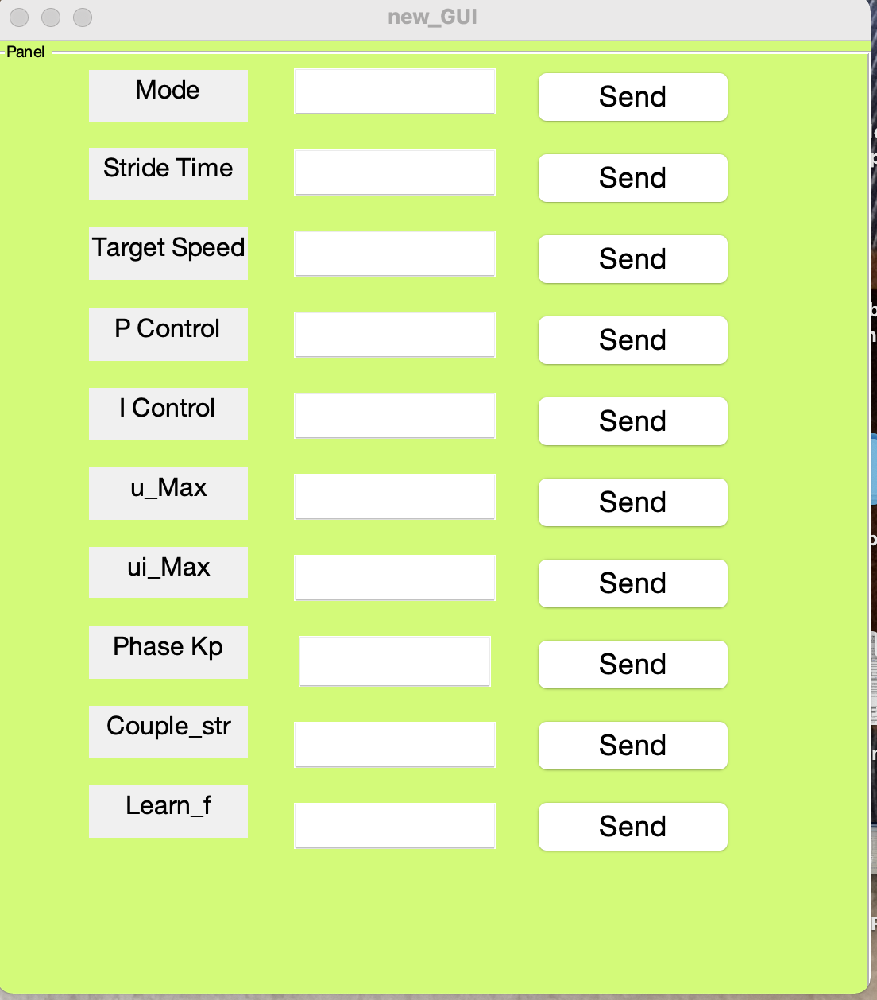

## Mapping
1. On the robot computer (192.168.1.100) (optionally ssh from the remote computer):
    1. Generate waypoints for the environment.
        ```bash
        $ rosrun gait_training_robot sunny_generate_waypoints.py
        ```
    1. Preview waypoints.
        ```bash
        $ rosrun gait_training_robot goal_generator _preview:=true _suffix:=_sunny_ccw
        $ rosrun gait_training_robot goal_generator _preview:=true _suffix:=_sunny_cw
        ```
    1. Start roscore
    1. Run the following
        ```bash
        $ roslaunch gait_training_robot rtabmap_map.launch disable_rviz:=true
        $ rosrun gait_training_robot goal_generator _max_num_laps:=1 _preview:=false _stop_upon_completion:=false _suffix:=_sunny_ccw
        $ rosrun gait_training_robot goal_generator _max_num_laps:=1 _preview:=false _stop_upon_completion:=false _suffix:=_sunny_cw
        ```

## Troubleshooting

* Test connection
```bash
rosrun sport_sole test_connection.bash
```

## Data Collection
1. On the robot computer (192.168.1.100):
    1. Start roscore
    1. Start sport_sole_publisher_vibration node (ssh-friendly)
        * `argc` must be 3 or higher;
        * `argv[1]` must follow the format "sbj001_0_1.0", where 0 is the mode and 1.0 is the target speed;
        * `argv[2]` is the path to the directory where .dat file will be stored.
        * `-s`: send enable packet
        * `-e`: require either insole data to be received before proceeding
        ```bash
        $ rosrun sport_sole sport_sole_publisher_vibration sbj001_0_1.0 $HOME/log
        $ rosrun sport_sole sport_sole_publisher_vibration sbj001_0_1.0 $HOME/log -s # send enable packet
        $ sudo renice -n -15 -p $SPORT_SOLE_PID # change niceness level
        ```
    1. Send parameters to Teensy through the GUI as shown in the screenshot below. And after the walk test, we need to download the data and then calculate the average speed which would be used as target speed.

        
    1. Run the following (cannot be through ssh)
        ```bash
        $ roslaunch gait_training_robot sunny_record.launch dir:=cw
        $ roslaunch gait_training_robot sunny_record.launch dir:=ccw
        ```
1. Start Zeno walkway.
2. (To be removed soon) On the remote computer (192.168.1.102):
    1. Run the following and select the bag file to play back
        ```bash
        $ roslaunch gait_training_robot sunny_play_remote.launch
        ```
    1. Start plotjuggler and load configuration "mos_only.xml"
        ```bash
        $ rosrun plotjuggler plotjuggler
        ```

## Data Playback
```
$ rosrun gait_training_robot sunny_play.py -h
usage: sunny_play.py [-h] [-r] [-p] [-s]

Play a bag file of user selection:

optional arguments:
  -h, --help          show this help message and exit
  -r, --record_all
  -p, --export_mat
  -s, --skip_bag_gen

```
Then run MATLAB script `sunny_plot_simple.m`.


## Network
### IP addresses
|IP            | hostname   |  Description
|--------------|------------|------------------
|192.168.1.254 |            |  Router, SSID: schgta
|192.168.1.100 | ral2020    |  Robot computer, HP-omen
|192.168.1.11  |            |  Left insole
|192.168.1.12  |            |  Right insole
|192.168.1.13  |            |  Sync board
|192.168.1.102 | ral        |  Remote computer 1, Thinkpad P51, wired connection


### Other
* Fix WAN routing issue
```bash
$ ip route list
$ ip route delete default
```

## Sampling period body tracking

```bash
$ rostopic echo -b data_2021-05-07-22-45-18.bag -p /body_tracking_data/markers[0]/header/stamp > ~/.ros/tmp
```

# Data Processing

## Compare with zeno data
* Apply foot pose EKF and record (-r) data in a bag file
```bash
roscd gait_training_robot/bags
rosrun gait_training_robot sunny_play.py data4[2-6]*.bag -r
```
* Skip recording (-s), calculate gait parameters, save them in pickle files (-i), in mat file (-p), and in csv file (-c).
```bash
roscd gait_training_robot/bags
rosrun gait_training_robot sunny_play.py data4[2-6]*.bag -si
```

* Update Qingya's validation table in the mat files. Compare with results calculated from sportsole data alone. Option `-c` calculates stride velocity using the stride length from robot and stride time from the SportSole. 
```bash
rosrun gait_training_robot update_validation_table.py
```

* Generate csv files and box plots. Option `-c` calculates stride velocity using the stride length from robot and stride time from the SportSole. (Dependent on the output of `update_validation_table.py`.) 
```bash
rosrun gait_training_robot validate_robot_against_csv.py
```

* Generate box plot of coefficient of variation. Option `-c` calculates stride velocity using the stride length from robot and stride time from the SportSole. (Dependent on the output of `update_validation_table.py`.)
```bash
rosrun gait_training_robot plot_cv_value_box.py
```

* Generate box plot of human-robot distance
```bash
rosrun gait_training_robot plot_dist_box.py
```
